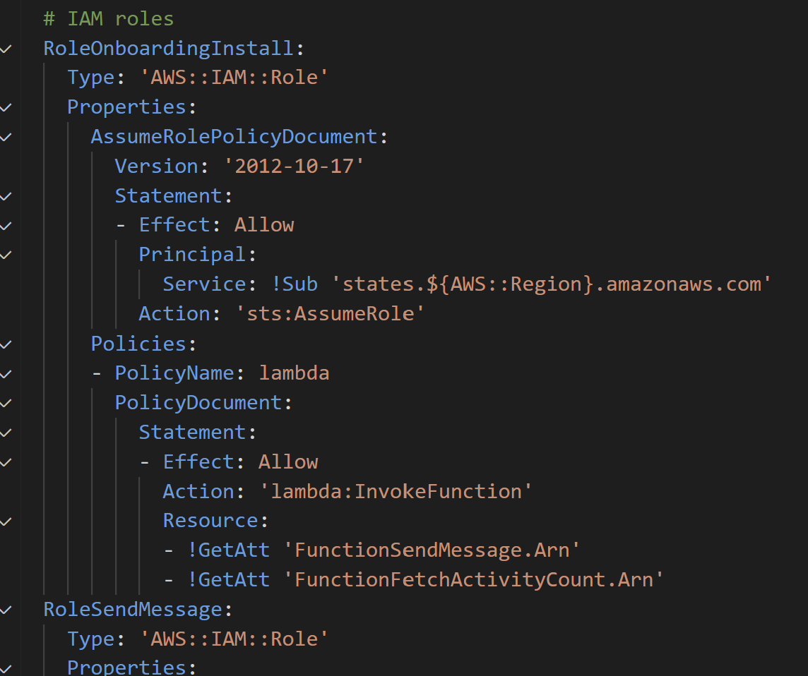
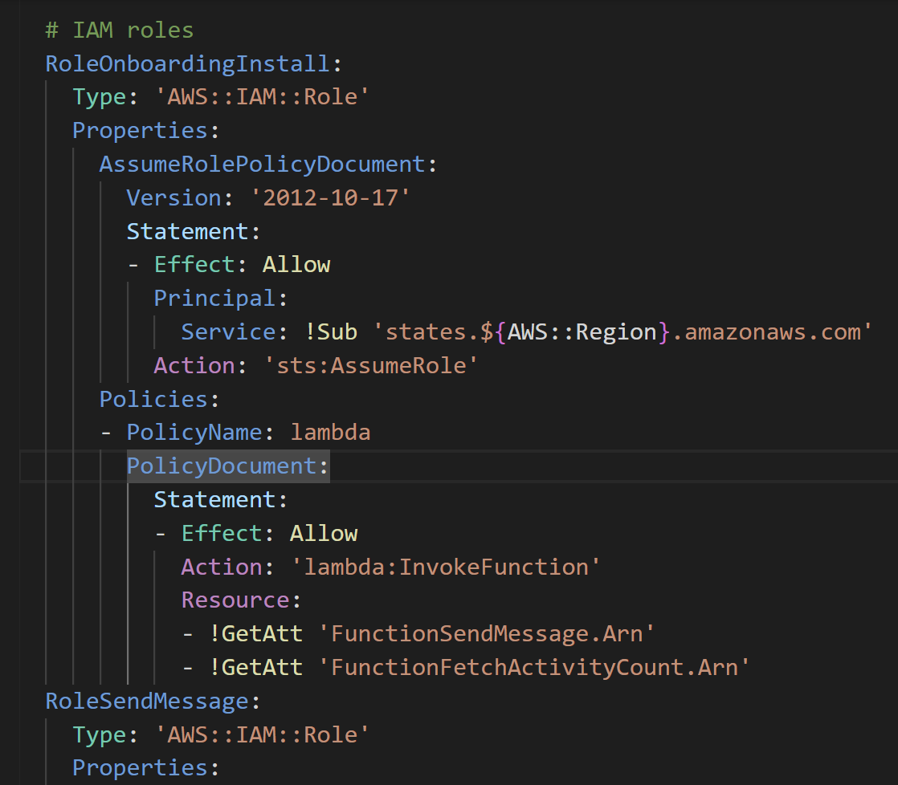

# CloudColor

This Visual Studio Code extension adds syntax highlighting to Cloudformation YAML. The extension makes the YAML more readable, instead of being blue and orange out like standard YAML.

Embedded json hilighting is also applied

## Before

## After

